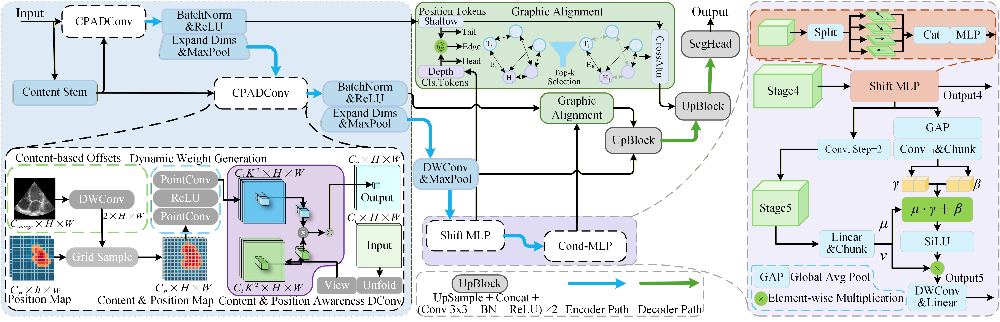
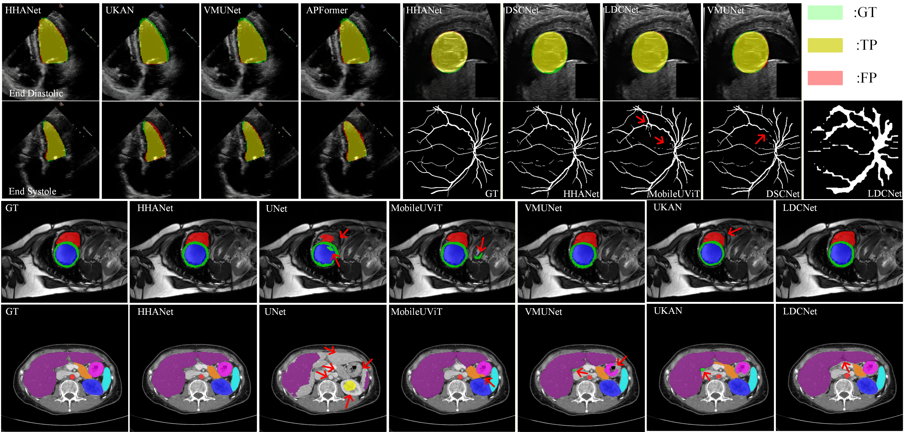

<div align="center">

# HHANet

**Hierarchical Heterogeneous Alignment Network for Lightweight Medical Image Segmentation**


</div>

<div align="center">
  
</div>

> Targets in medical images exhibit relatively fixed anatomical structures and spatial relationships, providing stable and exploitable structural priors — unlike natural images where targets vary considerably in appearance, scale, and distribution. HHANet exploits this property through representation-aligned computation.

## Highlights

- **CPADConv** — Content–Position Aware Dynamic Convolution that unifies a population-level anatomical prior with an instance-level deformation field in a single operator, enabling dual content–position awareness without additional inference overhead.
- **HM-MLP** — Hierarchically Modulated MLP for linear-complexity global semantic aggregation with cross-stage FiLM calibration, preventing representation collapse in deep stages.
- **GCA** — Graph-based Cross-level Alignment that formalizes skip-connection fusion as directed bipartite graph matching, explicitly aligning semantic and spatial features via Top-*k* sparse edges and learned gating.

<div align="center">
  
</div>

## Key Motivation

<div align="center">
  
</div>


## Results

### Model Variants

| Variant | Params | MACs | FPS (A6000) | FPS (Jetson Nano) |
|:--------|-------:|-----:|------------:|------------------:|
| HHANet-Tiny | 0.89M | 1.31G | 329 | 33.97 |
| HHANet-Base | 8.59M | 8.59G | 138.00 | 13.39 |

### Performance Comparison

<div align="center">
  
</div>

### Visualization

<div align="center">
  
</div>

## Installation

```bash
git clone https://github.com/PXinTao/HHANet.git
cd HHANet
pip install -r requirements.txt
```

Requirements: `torch>=2.0`, `torchvision>=0.15`, `numpy`, `opencv-python`, `Pillow`, `albumentations>=1.3`, `tqdm`, `scikit-learn`

## Quick Start

```python
from hhanet import build_hhanet

model = build_hhanet('tiny', num_classes=4)   # HHANet-Tiny
model = build_hhanet('base', num_classes=4)   # HHANet-Base
```

## Training

```bash
python train.py \
    --variant tiny \
    --dataset_dir /path/to/datasets \
    --dataset_name ACDC \
    --num_classes 1 \
    --epochs 300 \
    --batch_size 8 \
    --lr 1e-3 \
    --save_dir ./checkpoints/ACDC_tiny
```

### Supported Datasets

ACDC, EchoNet-Dynamic, Fetal_HC, Synapse, FIVES, Kvasir-SEG, TN3K, CVC-ClinicDB, and any custom dataset following this layout:

```
<dataset_dir>/<dataset_name>/<split>/imgs/*.png
<dataset_dir>/<dataset_name>/<split>/masks/*.png
```

### Training Details

| Setting | Value |
|:--------|:------|
| Loss | BCE + Dice |
| Optimizer | AdamW |
| LR Schedule | CosineAnnealingLR |
| Augmentation | Rotation, flip, brightness, blur, noise, elastic (albumentations) |
| Input Resolution | 256 × 256 |
| Metrics | Dice, mIoU |

## Project Structure

```
HHANet/
├── hhanet/
│   ├── models/
│   │   ├── hhanet.py          # Full model (encoder + decoder)
│   │   ├── encoder.py         # HHAEncoder
│   │   └── build.py           # Config & build_hhanet()
│   ├── layers/
│   │   ├── cpadconv.py        # CPADConv
│   │   ├── gca.py             # Graph Cross-level Alignment
│   │   ├── hm_mlp.py          # Hierarchically Modulated MLP
│   │   ├── tok_mlp.py         # Shifted MLP & Patch Embedding
│   │   └── blocks.py          # DWConv & UpBlock
│   └── utils/
│       └── factor.py
├── train.py
├── dataset.py
├── utils.py
├── requirements.txt
└── images/                    # Figures for README
```

## Citation

```bibtex
@article{hhanet2025,
  title={HHANet: Hierarchical Heterogeneous Alignment Network for Lightweight Medical Image Segmentation},
  author={},
  journal={},
  year={2025}
}
```

## License

This project is released under the [MIT License](LICENSE).
